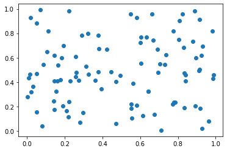
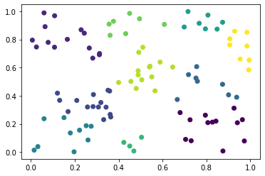
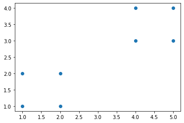
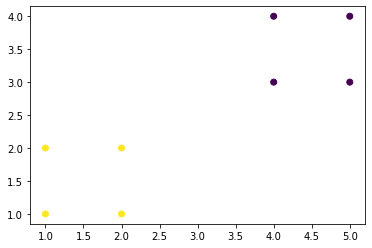

```python
import os
```


```python
os.path.join('DataWhale','docu')
```


    'DataWhale\\docu'


```python
os.getcwd()
```


    'E:\\Files\\wl_jupyter_notebook'


```python
os.chdir('E:\\Files\\Datawhale\\python办公自动化')
os.getcwd()
```


    'E:\\Files\\Datawhale\\python办公自动化'


```python
os.path.abspath('.')
```


    'E:\\Files\\Datawhale\\python办公自动化'


```python
os.path.isabs('.')
```


    False


```python
os.path.abspath(os.path.abspath('.'))
```


    'E:\\Files\\Datawhale\\python办公自动化'


```python
os.path.relpath('E:\\Files\\Datawhale\\python办公自动化',)#os.path.relpath(path,start),返回从start路径到path的相对路径的字符串。如果没提供start,就使用当前工作目录作为开始路径。
```


    '.'


```python
path = 'E:\\Files\\Datawhale\\python办公自动化\\excel到word.xlsx'
os.path.dirname(path)#返回路径名称
```


    'E:\\Files\\Datawhale\\python办公自动化'


```python
os.path.basename(path)#返回文件名称
```


    'excel到word.xlsx'


```python
caFilePath ='E:\\Files\\Datawhale\\python办公自动化\\excel到word.xlsx'
os.path.split(caFilePath)#获得两者字符串的元组
```


    ('E:\\Files\\Datawhale\\python办公自动化', 'excel到word.xlsx')


```python
(os.path.dirname(caFilePath),os.path.basename(caFilePath))#返回值放入元组中
```


    ('E:\\Files\\Datawhale\\python办公自动化', 'excel到word.xlsx')


```python
caFilePath.split(os.path.sep)#返回每个文件夹的字符串列表
```


    ['E:', 'Files', 'Datawhale', 'python办公自动化', 'excel到word.xlsx']


```python
from sklearn.cluster import KMeans
import matplotlib.pyplot as plt
import numpy as np
%matplotlib inline
X = np.random.rand(100,2)
#print(X)
plt.scatter(X[:,0],X[:,1],marker = 'o')
plt.show()
```


    

    


```python
kmeans = KMeans(n_clusters=10).fit(X)
label_pred = kmeans.labels_
plt.scatter(X[:, 0], X[:, 1], c=label_pred)
plt.show()
```


    

    


```python
from sklearn.cluster import KMeans
import matplotlib.pyplot as plt
import numpy as np
%matplotlib inline
#X = np.random.rand(100,2)
#print(X)
X = np.array([[1,1],[2,1],[1,2],[2,2],[4,3],[5,3],[4,4],[5,4]])
#print(X)
plt.scatter(X[:,0],X[:,1],marker = 'o')
plt.show()
```


    

    


```python
kmeans = KMeans(n_clusters=2).fit(X)
label_pred = kmeans.labels_
plt.scatter(X[:, 0], X[:, 1], c=label_pred)
plt.show()
```


    

    


```python

```
